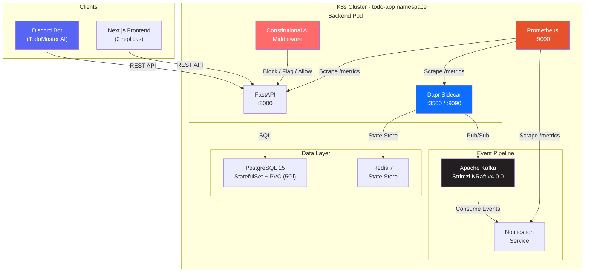
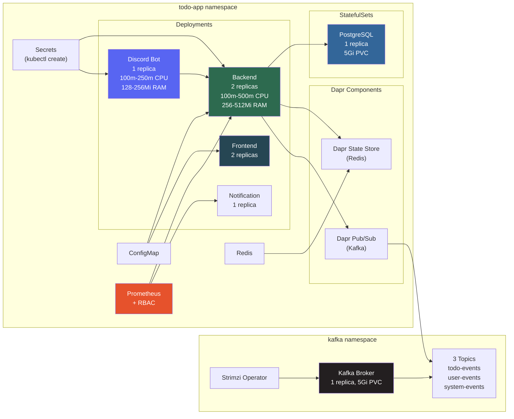
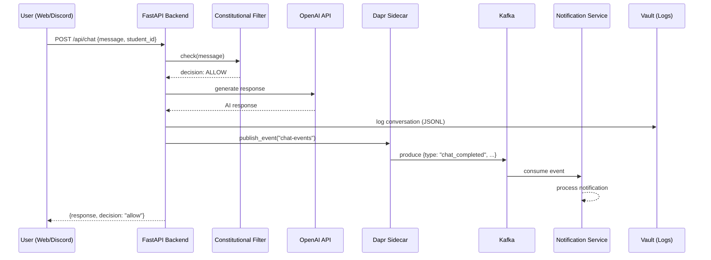
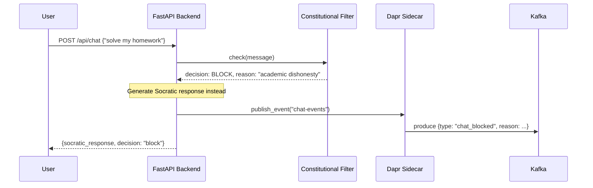
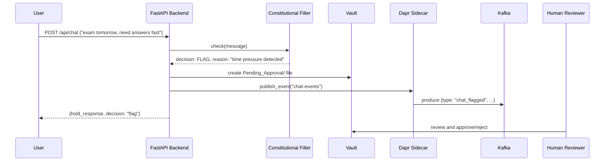
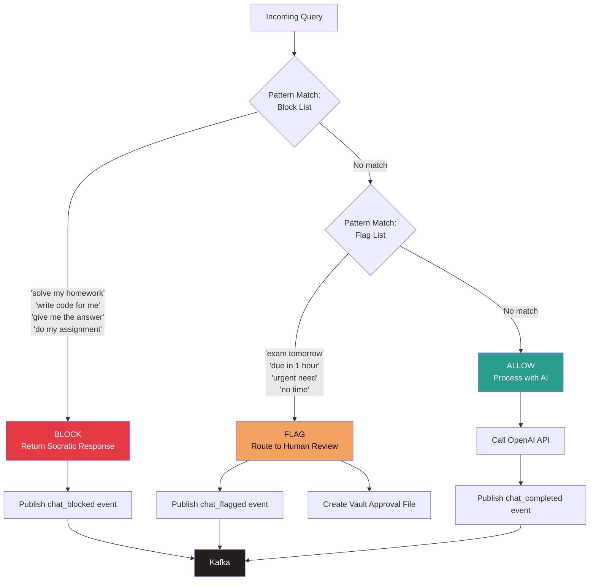
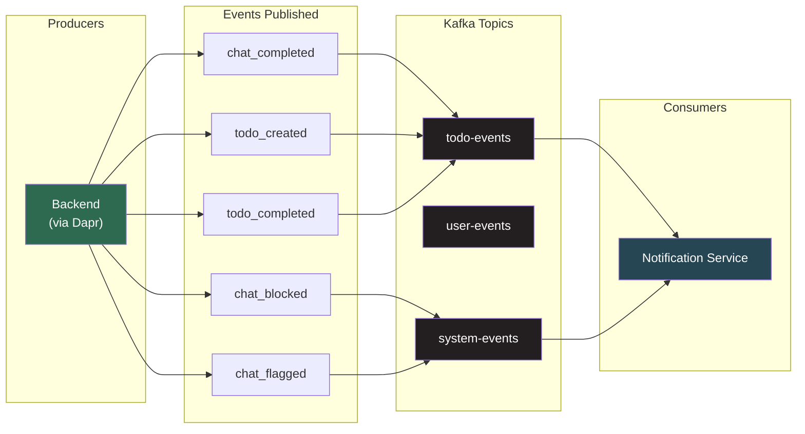
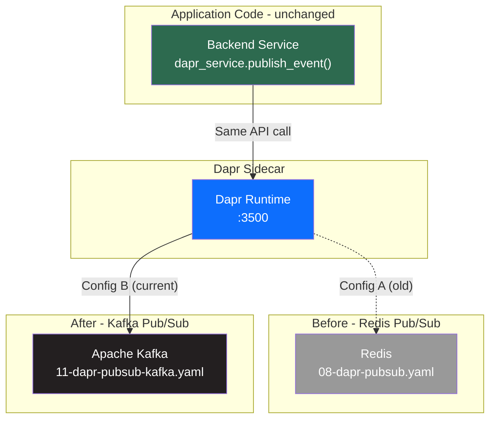
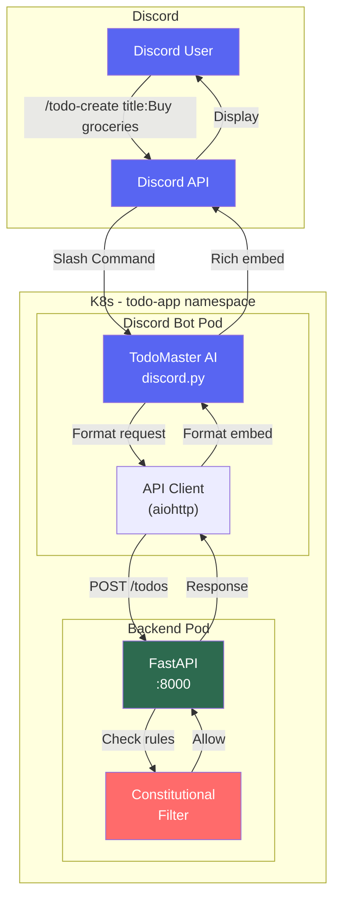
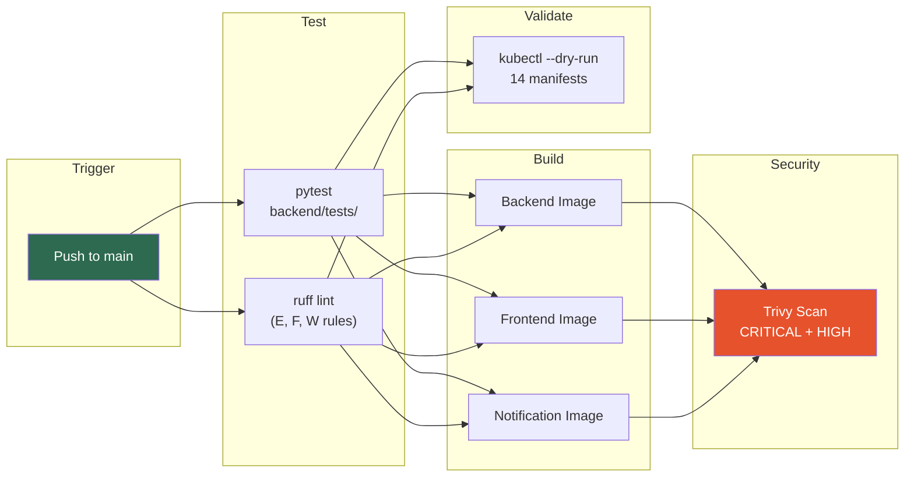

# Architecture

## System Overview

---

## Kubernetes Deployment Map

---

## Request Flow

### Normal Chat Request (ALLOW)

### Blocked Chat Request (Constitutional Violation)

### Flagged Chat Request (Human Review)

---

## Constitutional AI Pipeline

---

## Event-Driven Architecture

---

## Dapr Abstraction Layer

Shows how Dapr enabled a zero-code infrastructure swap from Redis to Kafka:

**What changed:** 1 YAML file. **What didn't change:** Application code.

---

## Discord Bot Architecture

---

## Resource Allocation (6GB Minikube Cluster)

| Service | CPU Request | CPU Limit | RAM Request | RAM Limit | Replicas |
|---------|------------|-----------|-------------|-----------|----------|
| Backend | 100m | 500m | 256Mi | 512Mi | 2 |
| Frontend | -- | -- | -- | -- | 2 |
| PostgreSQL | -- | -- | -- | -- | 1 |
| Redis | -- | -- | -- | -- | 1 |
| Kafka | 250m | 500m | 512Mi | 1Gi | 1 |
| Notification | -- | -- | -- | -- | 1 |
| Prometheus | -- | -- | -- | -- | 1 |
| Discord Bot | 100m | 250m | 128Mi | 256Mi | 1 |

**Total cluster utilization: ~44% of 6GB**

---

## CI/CD Pipeline

