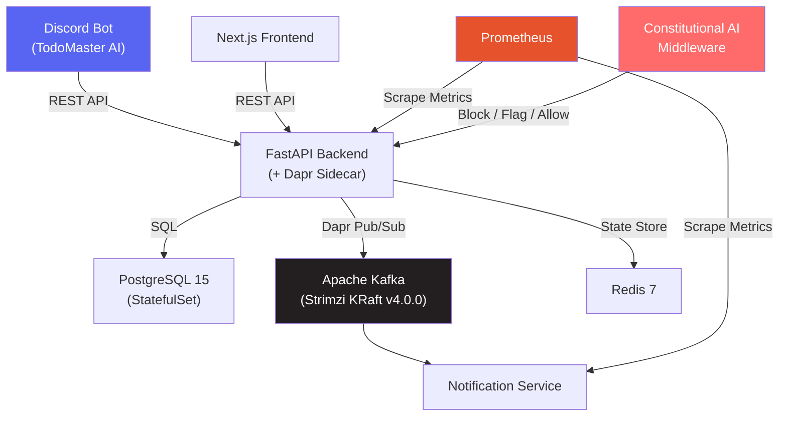
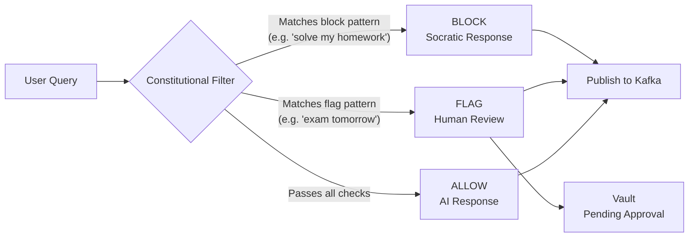

# Hackathon Completion Engine

**Cloud-Native AI-Powered Todo System with Constitutional AI Safety**

> A progressive hackathon series (H0-H4.5) building a production-grade, Kubernetes-orchestrated application with event-driven microservices, Constitutional AI filtering, and a Discord bot interface.

[]()
[]()
[]()
[]()
[]()
[]()

---

## Architecture



### Constitutional AI Decision Flow



---

## Hackathon Progression

Each hackathon built on the previous one, progressively adding complexity:

| Hackathon | Project | What I Built | Tier | Tests |
|-----------|---------|-------------|------|-------|
| **H0** | Personal AI CTO | File watcher, auto-categorization, HITL approvals | Bronze | 7/7 |
| **H1** | Course Companion | FastAPI backend, Constitutional AI filter, conversation tracking | Silver | -- |
| **H2** | AI-Powered Todo | Spec-driven development, AI spec generation, CRUD with constitution | Silver | -- |
| **H3** | Advanced Todo | Event-driven architecture, Kafka, Dapr, team collaboration, recurring todos | Gold | 149/149 |
| **H4** | Cloud-Native | Full Kubernetes cluster (14 manifests), CI/CD, Prometheus monitoring | Platinum | -- |
| **H4.5** | Discord Bot | TodoMaster AI with 6 slash commands, K8s deployment | Extended | 31/31 |

**Overall: 100% Complete (5/5 hackathons + extended Discord bot)**

---

## Tech Stack

| Layer | Technology |
|-------|-----------|
| **Orchestration** | Kubernetes (Minikube v1.35.0) |
| **Service Mesh** | Dapr (sidecar injection) |
| **Event Streaming** | Apache Kafka (Strimzi KRaft v4.0.0 -- no ZooKeeper) |
| **Backend** | Python FastAPI + Uvicorn |
| **Frontend** | Next.js 14 + TypeScript + Tailwind CSS |
| **Database** | PostgreSQL 15 (StatefulSet + PVC) |
| **Cache** | Redis 7 |
| **Monitoring** | Prometheus (4 scrape targets, custom metrics) |
| **AI** | OpenAI API + Constitutional AI middleware |
| **Bot** | discord.py with slash commands |
| **CI/CD** | GitHub Actions (test, build, validate, security scan) |
| **Containers** | Docker (multi-stage builds) |

---

## Key Technical Highlights

### 1. Constitutional AI Safety
Every user query passes through middleware that enforces academic integrity. Blocked queries receive Socratic responses instead of direct answers. Flagged queries go to a vault-based Human-in-the-Loop (HITL) approval workflow.

### 2. Zero-Code Infrastructure Swap
Dapr's abstraction layer let me switch pub/sub from Redis to Apache Kafka by changing **1 YAML file** -- zero application code changes. This proves the architecture is truly infrastructure-agnostic.

### 3. 14 Kubernetes Services in 6GB
Full production stack (Kafka + Dapr + Prometheus + PostgreSQL + 4 microservices) deployed in a resource-constrained Minikube cluster at only **44% memory utilization**.

### 4. Event-Driven Audit Trail
Every interaction publishes events (`chat_completed`, `chat_blocked`, `chat_flagged`, `todo_created`, `todo_completed`) to Kafka topics with 24-hour retention -- full accountability.

### 5. Discord as Alternative Frontend
The Discord bot connects to the same Kubernetes backend, proving the API-first architecture works across interfaces while maintaining Constitutional AI compliance.

---

## Quick Start

### Option A: Full Kubernetes Deployment

**Prerequisites:** Docker, Minikube, kubectl, Dapr CLI

```bash
# Start cluster
minikube start --memory=6144 --cpus=4 --driver=docker

# Deploy infrastructure
kubectl apply -f hackathons/h4-cloud-native/k8s/base/00-namespace.yaml
kubectl apply -f hackathons/h4-cloud-native/k8s/base/01-configmap.yaml
kubectl create secret generic todo-secrets -n todo-app \
  --from-literal=OPENAI_API_KEY=your-key
kubectl apply -f hackathons/h4-cloud-native/k8s/base/03-postgresql.yaml

# Install Dapr
dapr init -k
kubectl apply -f hackathons/h4-cloud-native/k8s/base/07-dapr-statestore.yaml

# Deploy Kafka (Strimzi)
kubectl create namespace kafka
kubectl apply -f 'https://strimzi.io/install/latest?namespace=kafka' -n kafka
kubectl apply -f hackathons/h4-cloud-native/k8s/base/09-kafka.yaml
kubectl apply -f hackathons/h4-cloud-native/k8s/base/10-kafka-topics.yaml
kubectl apply -f hackathons/h4-cloud-native/k8s/base/11-dapr-pubsub-kafka.yaml

# Deploy applications
kubectl apply -f hackathons/h4-cloud-native/k8s/base/04-backend.yaml
kubectl apply -f hackathons/h4-cloud-native/k8s/base/05-frontend.yaml
kubectl apply -f hackathons/h4-cloud-native/k8s/base/12-notification-service.yaml
kubectl apply -f hackathons/h4-cloud-native/k8s/base/13-prometheus.yaml
kubectl apply -f hackathons/h4-cloud-native/k8s/base/14-discord-bot.yaml

# Verify all pods running
kubectl get pods -n todo-app
kubectl get pods -n kafka

# Access the app
minikube service todo-app-frontend -n todo-app
```

### Option B: Local Development

```bash
# Backend
cd backend
pip install -r requirements.txt
uvicorn main:app --reload --port 8000

# Frontend (separate terminal)
cd frontend
npm install && npm run dev
```

---

## Kubernetes Services

14 manifests deploying the following resources in `todo-app` and `kafka` namespaces:

| Manifest | Resource | Purpose |
|----------|----------|---------|
| `00-namespace` | Namespace | `todo-app` + `kafka` namespaces |
| `01-configmap` | ConfigMap | Database URLs, API config, env vars |
| `02-secret` | Secret | API keys (created via kubectl) |
| `03-postgresql` | StatefulSet + PVC | Persistent database (5Gi) |
| `04-backend` | Deployment + Service | FastAPI (2 replicas, Dapr sidecar) |
| `05-frontend` | Deployment + Service | Next.js (2 replicas) |
| `06-redis` | Deployment + PVC | Cache and state store |
| `07-dapr-statestore` | Dapr Component | Redis state management |
| `08-dapr-pubsub` | Dapr Component | Redis pub/sub (legacy) |
| `09-kafka` | Strimzi KRaft | Kafka broker (no ZooKeeper) |
| `10-kafka-topics` | KafkaTopic | 3 topics: todo-events, user-events, system-events |
| `11-dapr-pubsub-kafka` | Dapr Component | Kafka pub/sub (active) |
| `12-notification` | Deployment + Service | Kafka event consumer |
| `13-prometheus` | Deployment + RBAC | Monitoring (4 scrape targets) |
| `14-discord-bot` | Deployment | TodoMaster AI Discord bot |

---

## Discord Bot -- TodoMaster AI

6 slash commands connecting Discord to the Kubernetes backend:

| Command | Description |
|---------|-------------|
| `/todo-create` | Create a todo (title, priority, category, deadline) |
| `/todo-list` | List todos with filtering (all, active, completed) |
| `/todo-show` | Show todo details (supports ID prefix matching) |
| `/todo-complete` | Mark a todo as completed |
| `/todo-delete` | Delete a todo |
| `/help` | Show bot commands and info |

---

## CI/CD Pipeline

GitHub Actions workflow triggered on push to `main`:

```
Test (pytest + ruff) --> Build (3 Docker images) --> Validate (K8s manifests) --> Security (Trivy scan)
```

---

## Project Structure

```
hackathon-completion-engine/
├── .github/workflows/         # CI/CD pipelines
├── backend/                   # FastAPI backend
│   ├── main.py                # App entry + Dapr init
│   ├── middleware/             # Constitutional AI filter
│   ├── routers/               # API endpoints (chat, progress)
│   └── services/              # ChatGPT, Dapr, Logger services
├── frontend/                  # Next.js frontend
├── hackathons/
│   ├── h0-personal-ai-cto/    # Bronze: File watcher + HITL
│   ├── h1-course-companion/   # Silver: Constitutional AI
│   ├── h2-todo-spec-driven/   # Silver: Spec-driven dev
│   ├── h3-advanced-todo/      # Gold: Event-driven (149 tests)
│   └── h4-cloud-native/       # Platinum: Kubernetes
│       ├── k8s/base/          # 14 K8s manifests
│       ├── docker/            # 4 multi-stage Dockerfiles
│       ├── services/
│       │   └── discord-bot/   # H4.5: Discord bot (31 tests)
│       ├── helm/              # Helm chart
│       ├── scripts/           # Deploy, build, verify scripts
│       └── docs/              # Session documentation
├── vault/                     # Obsidian-compatible knowledge base
│   ├── Conversation_Logs/     # JSONL chat history
│   └── Pending_Approval/      # HITL approval queue
├── engine/                    # Universal execution framework
├── skills-library/            # 39+ reusable agent skills
└── specs/                     # Specification documents
```

---

## Methodology

### Spec-Driven Development
No code exists without a specification first. Each hackathon follows:

1. **Specification** -- Detailed requirements document
2. **Planning** -- 4 sessions (Foundation, Implementation, Integration, Validation)
3. **Execution** -- Claude Code assisted implementation
4. **Testing** -- Comprehensive test suites
5. **Documentation** -- README + completion report

### Architectural Patterns

| Pattern | Implementation |
|---------|---------------|
| **Constitutional AI** | Regex-based middleware with block/flag/allow decisions |
| **Event-Driven** | Dapr pub/sub over Kafka with 5 event types |
| **HITL Workflow** | Vault-based folder workflow (Pending --> Approved/Rejected) |
| **Zero-Backend-LLM** | Frontend is thin client; all AI logic in backend |
| **API-First** | Same backend serves web frontend + Discord bot |
| **Infrastructure-Agnostic** | Dapr abstracts message broker (Redis <--> Kafka swap) |

---

## Author

**Asadullah Shafique**
- GitHub: [@asadullah48](https://github.com/asadullah48)
- GIAIC Roll: 00458550
- Program: Panaversity Hackathon II

---

## License

MIT License - See LICENSE file for details

---

**Built with systematic hackathon methodology -- Bronze to Platinum in 5 progressive iterations**
**January - February 2026 | Panaversity Hackathon Series**
